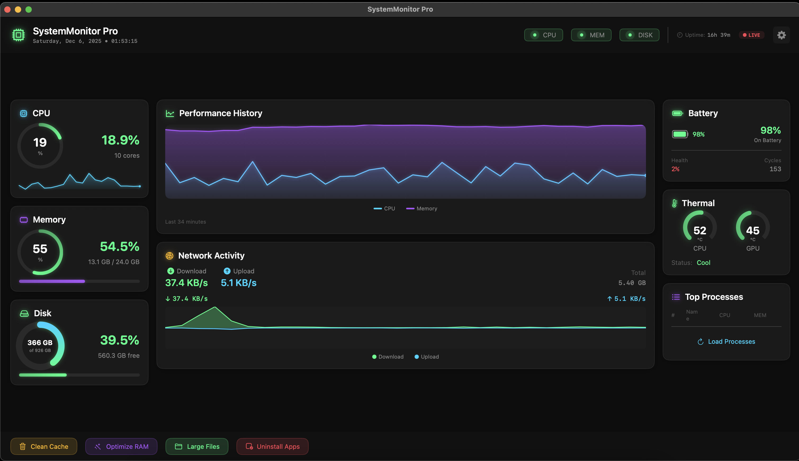

<div align="center">

# SystemMonitor Pro

### The Ultimate Free & Open Source System Monitor for macOS

[](https://www.apple.com/macos)
[](https://swift.org)
[](LICENSE)
[](https://github.com/sulimanapps/SystemMonitor/stargazers)
[](https://github.com/sulimanapps/SystemMonitor/releases)

**A beautiful, powerful, and FREE alternative to iStat Menus, CleanMyMac, and Stats**

[Download](https://github.com/sulimanapps/SystemMonitor/releases) | [Star this repo](https://github.com/sulimanapps/SystemMonitor) | [Report Bug](https://github.com/sulimanapps/SystemMonitor/issues)

</div>

---

## Why SystemMonitor Pro?

Looking for a **free alternative to iStat Menus** or **CleanMyMac**? SystemMonitor Pro is a **100% free, open-source system monitor for Mac** that rivals premium apps costing $50+.

- **Native macOS app** - Built with SwiftUI for Apple Silicon (M1, M2, M3, M4) and Intel
- **Beautiful dark UI** - Professional NOC-style dashboard
- **Lightweight** - Only ~700KB, uses minimal resources
- **Privacy-focused** - No data collection, no analytics, no internet required
- **Open source** - See exactly what the code does

---

## Features

### Real-Time Monitoring
- **CPU** - Live usage percentage with historical graph
- **Memory** - RAM consumption with used/total breakdown
- **Disk** - Storage space monitoring and read/write speeds
- **Temperature** - CPU and GPU thermal readings
- **Battery** - Health percentage, cycle count, charging status
- **Network** - Upload and download speeds

### Cleanup Tools
- **Smart Clean** - One-click comprehensive system cleanup (NEW!)
- **Cache Cleaner** - Remove Safari, Chrome, Xcode, system caches
- **Large Files Finder** - Find and delete space-hogging files
- **App Uninstaller** - Complete removal with leftover cleanup
- **RAM Optimizer** - Free up unused memory instantly

### System Tools (NEW in v2.2!)
- **Hardware Integrity Check** - Verify hardware authenticity and detect modifications
- **Disk Health** - S.M.A.R.T. status monitoring for all drives
- **Process Manager** - View and kill running processes
- **Startup Manager** - Control login items and launch agents
- **System Report** - Export comprehensive system information

### Smart Features
- **Menu Bar Integration** - Always accessible from your menu bar
- **Color-coded Status** - Green/Yellow/Red based on system health
- **Smart Alerts** - Get notified when CPU, RAM, or Disk is high
- **Configurable Refresh** - Set update interval (1-10 seconds)
- **Keyboard Shortcuts** - Quick access with hotkeys

---

## Screenshots

### Dashboard


### Uninstall Apps


### Settings


---

## Installation

### Option 1: Download Ready App (Recommended)
> No Xcode needed - just download and use!

1. Go to [Releases](https://github.com/sulimanapps/SystemMonitor/releases)
2. Download `SystemMonitor-v2.2.0.zip`
3. Unzip and drag `SystemMonitor.app` to `/Applications`
4. Done!

**First Launch:**
Since the app is not from the App Store, macOS requires approval:
1. Right-click on SystemMonitor.app
2. Click "Open"
3. Click "Open" again in the popup

Or: **System Settings > Privacy & Security > Open Anyway**

---

### Option 2: Build from Source (For Developers)

**Requirements:**
- macOS 14.0+
- Xcode 15+

```bash
git clone https://github.com/sulimanapps/SystemMonitor.git
cd SystemMonitor
open SystemMonitor.xcodeproj
```

In Xcode: Select your Team in Signing, then `Cmd + R` to build.

---

## System Requirements

| Requirement | Minimum |
|-------------|---------|
| macOS | 14.0 (Sonoma) or later |
| Chip | Apple Silicon (M1/M2/M3/M4) or Intel |
| RAM | 4 GB |
| Disk | 50 MB |

---

## Usage

1. **Launch** - Click the CPU icon in your menu bar
2. **Monitor** - View real-time system metrics on the dashboard
3. **Clean** - Use action buttons to clean cache, optimize RAM, find large files
4. **Settings** - Click the gear icon to configure alerts and refresh rate

---

## Keyboard Shortcuts

| Shortcut | Action |
|----------|--------|
| `Cmd + Q` | Quit Application |
| `Cmd + ,` | Open Settings |
| `Cmd + R` | Refresh System Data |
| `Cmd + 1` | Show Dashboard |
| `Cmd + 2` | Show Apps List |
| `Cmd + 3` | Show Large Files |
| `Cmd + W` | Close Window |

---

## Comparison

| Feature | SystemMonitor Pro | iStat Menus | CleanMyMac |
|---------|-------------------|-------------|------------|
| Price | **FREE** | $11.99 | $89.95/yr |
| Open Source | **Yes** | No | No |
| CPU/RAM/Disk Monitor | Yes | Yes | Yes |
| Temperature Monitor | Yes | Yes | No |
| Battery Health | Yes | Yes | No |
| Cache Cleaner | Yes | No | Yes |
| App Uninstaller | Yes | No | Yes |
| Menu Bar App | Yes | Yes | No |
| Apple Silicon Native | Yes | Yes | Yes |

---

## Project Structure

```
SystemMonitor/
├── SystemMonitorApp.swift      # App entry point
├── StatusBarController.swift   # Menu bar management
├── DashboardView.swift         # Main dashboard UI
├── SystemMonitor.swift         # Core system metrics
├── FeatureManager.swift        # Extended features
├── CacheManager.swift          # Cache scanning/cleaning
├── AppManager.swift            # App uninstall logic
├── Theme.swift                 # UI theming
└── ...                         # Additional components
```

---

## Tech Stack

- **SwiftUI** - Modern declarative UI framework
- **AppKit** - Native macOS integration
- **Combine** - Reactive data binding
- **Darwin/IOKit** - Low-level system APIs

---

## Safety & Privacy

- System apps are protected from uninstallation
- Files are moved to Trash, not permanently deleted
- Confirmation dialogs before any destructive action
- Running app detection with warnings
- **Zero data collection** - Everything stays on your Mac

---

## Troubleshooting

### App won't open - "damaged" or "unidentified developer"
```bash
# Run this in Terminal:
xattr -cr /Applications/SystemMonitor.app
```
Then right-click > Open > Open

### Temperature shows 0 or N/A
- Some Intel Macs don't expose temperature sensors
- Apple Silicon Macs show CPU temperature only

### High CPU usage
- Update to v2.0.4 or later (fixed in this version)
- Try increasing refresh interval in Settings (5-10 seconds)

### App doesn't appear in menu bar
- Check if menu bar is full - drag some icons out
- Try relaunching the app

### Cache size shows 0 KB
- Run the app with Full Disk Access enabled
- System Settings > Privacy & Security > Full Disk Access > Add SystemMonitor

---

## Roadmap

### v2.1 (Coming Soon)
- [ ] GPU usage monitoring
- [ ] Fan speed control
- [ ] Custom menu bar display options
- [ ] Notification center widgets

### v2.2 (Current)
- [x] Hardware Integrity Check (battery, storage, display, memory verification)
- [x] Disk health (S.M.A.R.T.)
- [x] Process manager (kill apps)
- [x] Startup items manager
- [x] Export system report

### v3.0 (Future)
- [ ] iOS companion app
- [ ] Multiple Mac monitoring
- [ ] Historical data & charts
- [ ] Homebrew installation

---

## Contributing

Contributions are welcome! Please read [CONTRIBUTING.md](CONTRIBUTING.md) for guidelines.

1. Fork the repository
2. Create your feature branch (`git checkout -b feature/amazing-feature`)
3. Commit your changes (`git commit -m 'Add amazing feature'`)
4. Push to the branch (`git push origin feature/amazing-feature`)
5. Open a Pull Request

---

## License

This project is licensed under the MIT License - see the [LICENSE](LICENSE) file for details.

---

## Author

**Suliman **
Email: xsuliman@gmail.com
GitHub: [@sulimanapps](https://github.com/sulimanapps)

---

## Support

If you find this project useful, please consider:
- Giving it a star on GitHub
- Sharing it with others
- [Reporting bugs](https://github.com/sulimanapps/SystemMonitor/issues) to help improve it

---

<div align="center">

**Made with Swift for macOS**

*Free and open-source system monitor for Mac | Alternative to iStat Menus and CleanMyMac*

</div>
